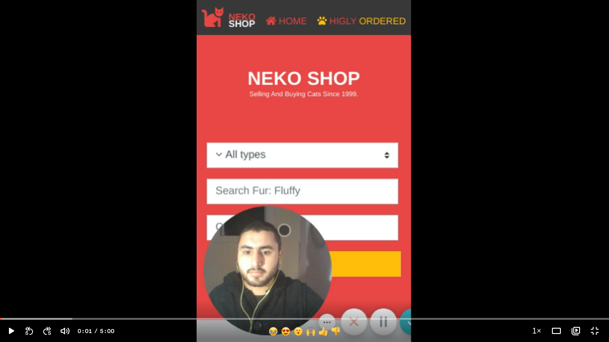
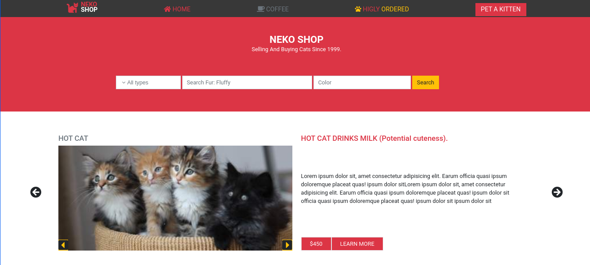
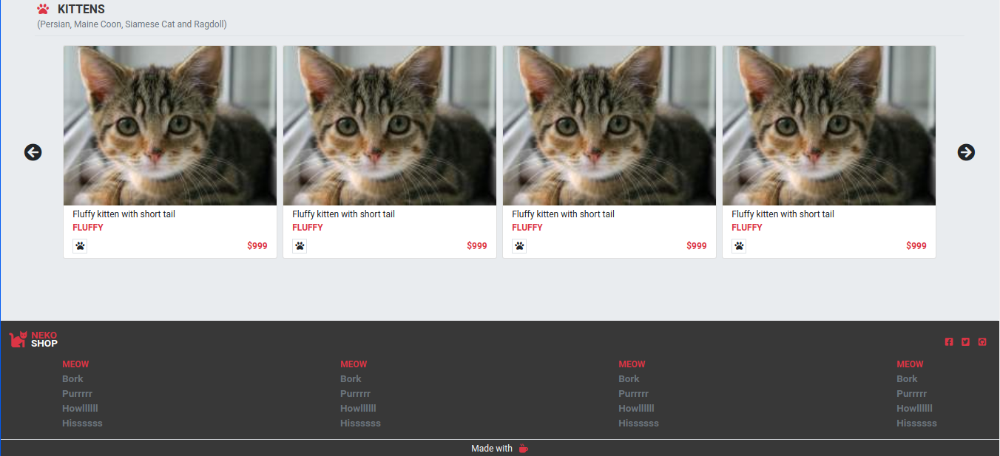
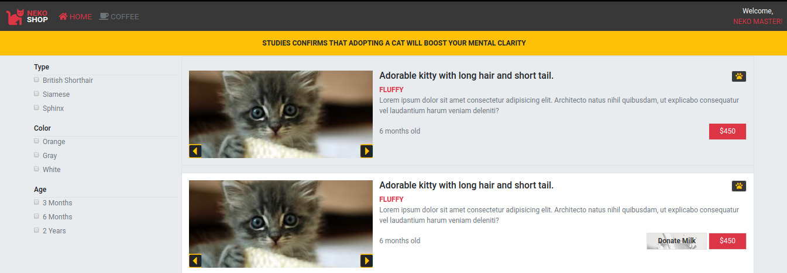

# HTML-CSS-Capstone

This is the Microverse capstone project of HTML & CSS Module.
I have built a responsive pet shop inspired by electronic shop.
Desgin idea by [Mohammed Awad](https://www.behance.net/gallery/24796463/ZATTIX)
The project consist of two pages:
-Home page
-Search page

## Video preview

## How to install

- Open CMD
- write this command: git clone https://github.com/AbdelrhmanAmin/HTML-CSS-Capstone.git
- Open the containing folder then open index.html

## Home page

- responsive navbar
- Manually created logo
- search field
- Hot ad for a cat
  

## Bottom home page

- Display different products
- Simple footer links for website map
- Giving credit to COFFEE <3
  

## Search page

- Dashboard nav
- Displaying search results
- Displaying category list
- Funny "Donate milk" button
  

## Built With

- HTML5.
- CSS3.
- Flexbox.
- Grid.
- Fontawesome.
- Bootstrap.

## Usage

To switch between the pages, You can simply click on the logo to go the main page, And Click on Pet kitten or Highly ordered or search button to see the search result page.

## Live Demo

[Demo](https://raw.githack.com/AbdelrhmanAmin/HTML-CSS-Capstone/feature-branch/index.html)

## Author

😎 **Abdo Amin**

- GitHub: [@Abdelrhman-Amin](https://github.com/AbdelrhmanAmin)
- Twitter: [@Abdo Amin](https://twitter.com/AbdoAmi60489112)
- LinkedIn: [@Abdo Amin](https://www.linkedin.com/in/abdo-amin-ab786a1b0/)

## Acknowledgements

Desgin idea by [Mohammed Awad](https://www.behance.net/gallery/24796463/ZATTIX)

## 🤝 Contributing

Contributions, issues, and feature requests are welcome!

Feel free to check the [issues page](https://github.com/AbdelrhmanAmin/HTML-CSS-Capstone/issues).

## 📝 License

This project is [MIT](./LICENSE) licensed.
